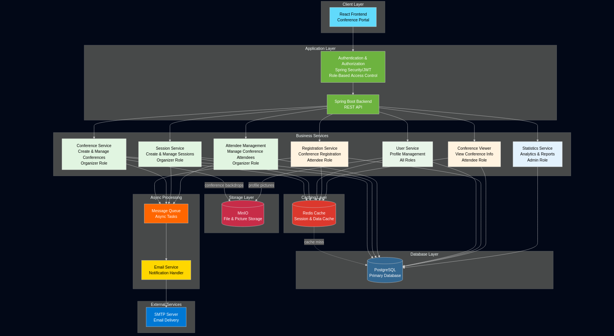
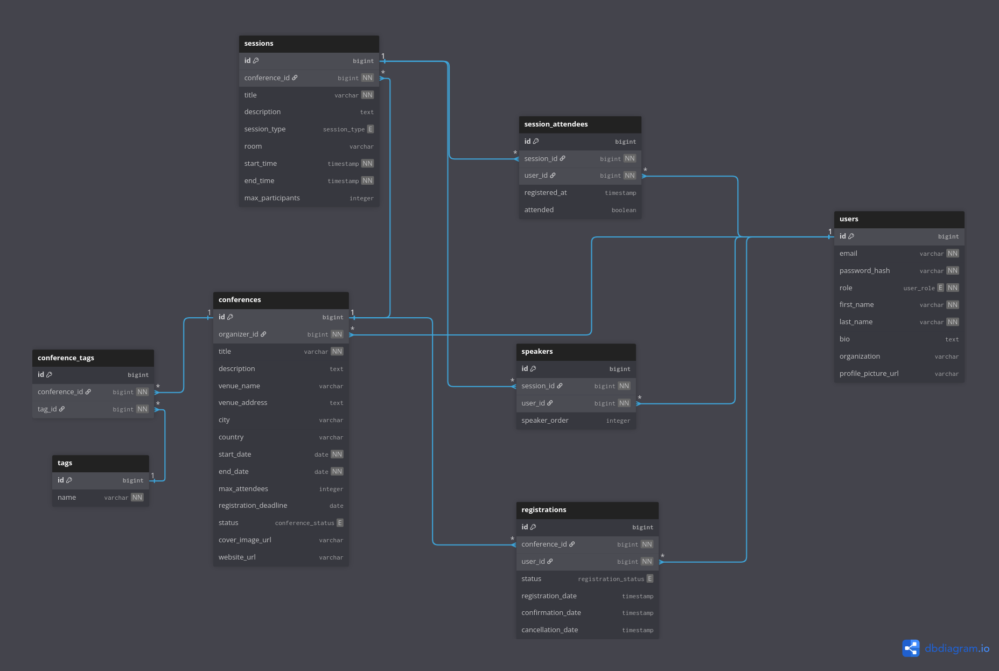

# ConferenceHub

## Cuprins
- [Descrierea Scopului Aplicației](#descrierea-scopului-aplicației)
- [Instrucțiuni de Rulare](#instrucțiuni-de-rulare)
- [Tehnologii Utilizate](#tehnologii-utilizate)
- [Funcționalități](#funcționalități)
- [Arhitectura Aplicației](#arhitectura-aplicației)

---

## Descrierea Scopului Aplicației

ConferenceHub se dorește să fie o platformă digitală care să faciliteze procesul complet de organizare și participare la conferințe academice și profesionale. Participanții în platformă pot fi organizatori de conferințe, speakeri, participanți sau administratori ai platformei.
    Organizatorii pot crea și gestiona conferințe complete, definind sesiuni, speakeri și agende detaliate. Pot gestiona participanții înscriși, monitoriza prezența și comunica cu aceștia prin notificări email automate. Participantii pot naviga prin conferințele disponibile, pot vizualiza informații detaliate despre sesiuni și speakeri, și se pot înregistra la evenimentele care îi interesează.
    Scopul general al platformei este să simplifice întregul proces legat de conferințe - de la crearea și promovarea evenimentului, la gestionarea înregistrărilor, stocarea materialelor de prezentare (backdrop-uri pentru conferințe, poze de profil), până la generarea de rapoarte și statistici pentru organizatori. Platforma oferă o experiență centralizată și intuitivă, eliminând nevoia de multiple instrumente disparate și facilitând comunicarea eficientă între toate părțile implicate în organizarea și participarea la conferințe.

---

## Instrucțiuni de Rulare

### Cerințe Preliminare
- Docker

### Pași de Instalare

1. **Clonarea repository-ului**
```bash
   git clone https://github.com/sebi-stefan/Conference-Management-System.git
   cd Conference-Management-System/docker
```

2. **Pornirea aplicației**
```bash
    docker compose up 
```

3. **Accesarea aplicației**
   - Frontend - http://localhost:3000
   - Backend - http://localhost:8080

---

## Tehnologii Utilizate

### Frontend
- React
- Javascript

### Backend
- Spring Boot, minIO, Redis

### Database
- PostgreSQL

### Altele
- Docker

---

## Funcționalități

### Funcționalități Implementate

1. User Management
2. Conference CRUD
3. Session CRUD

### Funcționalități Planificate

- Attendee Management
- Admin Use cases

---

## Arhitectura Aplicației

### Diagrama de Arhitectură



### Diagrama baza de date



